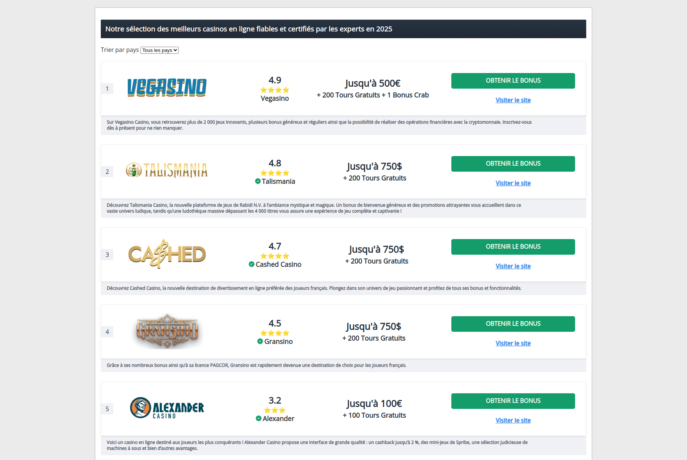

# PHP Fullstack Developer Technical Test (Blue Window Ltd)



## Getting Started

This project uses PHP 8.2+, Laravel, and Docker. Follow the steps below to set it up.

### Prerequisites

Ensure you have the following installed on your machine:

- **PHP 8.2+**
- **Laravel**
- **Docker** and **Docker Compose**

---

## Cloning the Project

Clone the repository (make sure to use the `develop` branch):

```bash
git clone -b develop https://github.com/AlexNguetcha/bluewindowltd-brand-toplist
```

---

## Running the Project

The easiest way to run this project is using **Docker**. Here's how:

1. Navigate to the project folder and run:

    ```bash
    cd bluewindowltd-brand-toplist
    docker-compose up --build
    ```

2. Docker will build and start two containers:

   - **App container (Laravel)** on port **8000**
   - **MySQL container** on port **3306**

   If you face any port conflicts, modify the ports in `docker-compose.yml` or temporarily stop the conflicting applications.

3. Once the containers are running, open your browser and visit:

   ```
   http://127.0.0.1:8000
   ```

---

## Setting Up the Database

1. List the running Docker containers to find the MySQL container ID:

    ```bash
    docker ps
    ```

2. Access the **App container** (Laravel) using the following command:

    ```bash
    docker exec -it <app_container_id> bash
    ```

   This will give you access to the app's terminal.

3. After that, access the **MySQL container**:

    ```bash
    docker exec -it <mysql_container_id> bash
    ```

4. Inside the MySQL container, create the database:

    ```sql
    CREATE DATABASE brand_toplist;
    ```

---

## Running Migrations and Seeding Data

Now, back inside the **App container**, run these commands to set up the database schema and seed it with brands:

1. Migrate the database:

    ```bash
    php artisan migrate
    ```

2. Seed the `brands` table:

    ```bash
    php artisan db:seed --class=BrandSeeder
    ```

---

## Accessing the Application

```
http://127.0.0.1:8000
```